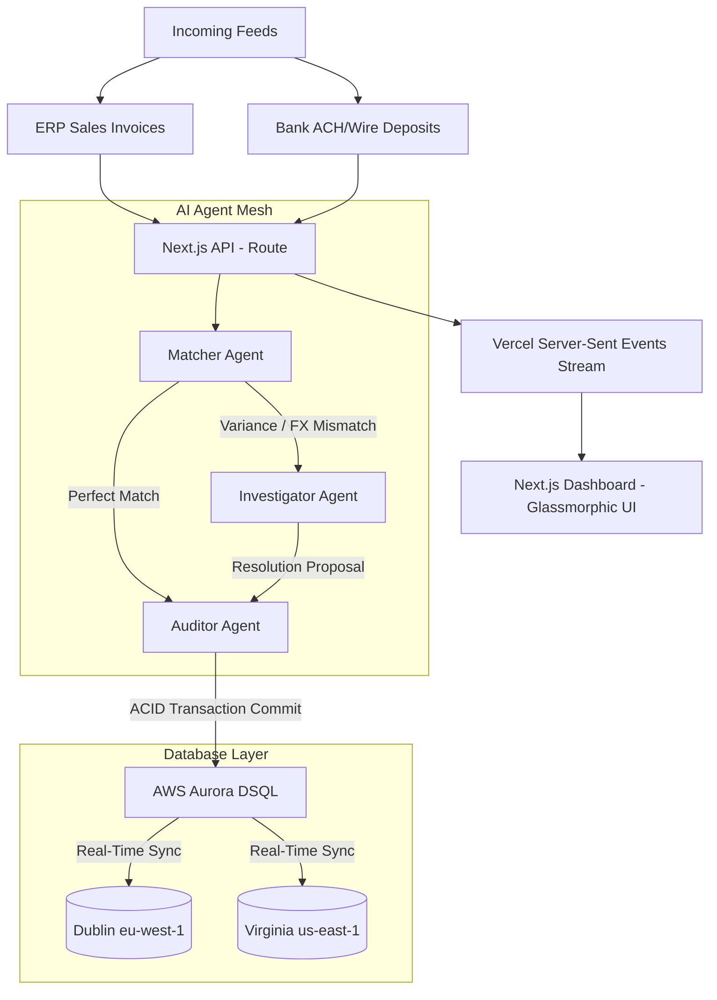

# 🔮 Zenith Treasury
### **B2B Multi-Agent Treasury & Cross-Border Ledger Orchestrator**
*Created for the **H0: Hack the Zero Stack with Vercel v0 and AWS Databases** hackathon (#H0Hackathon)*

---

**Zenith Treasury** is a premium, AI-native B2B treasury reconciliation engine designed for multinational corporations. By combining the transaction speed and multi-region ACID compliance of **AWS Aurora DSQL** (Distributed SQL) with **Vercel's Serverless/Edge** infrastructure, Zenith Treasury automatically processes bank statement streams against ERP invoices using an autonomous, collaborative mesh of three AI agents.

---

## 🏗️ System Architecture



---

## ⚡ Tech Stack & Integrations

1.  **Frontend:** Next.js (App Router, Tailwind CSS, Lucide icons) deployed on **Vercel** with edge optimizations.
2.  **AI Agents:** Built using the **Vercel AI SDK** with structured prompts organizing collaborative matching workflows.
3.  **Database Connection:** **Prisma v7 ORM** utilizing `@prisma/adapter-pg` and `pg` native drivers for Postgres-compliant active-active database writing.
4.  **Core Database:** **AWS Aurora DSQL** providing globally replicated, multi-region relational transactional consistency without master/replica replication lag.

---

## 🤖 The Autonomous Agent Mesh

The platform is orchestrated by three distinct agents who converse in real-time to solve complex corporate ledger scenarios:

*   **🔍 Matcher Agent:** Scans bank feeds and invoice logs. If transactions align perfectly, it forwards them to the Auditor. If a mismatch in amount, currency, or metadata is detected, it flags the issue and escalates it to the Investigator.
*   **⚠️ Investigator Agent:** Resolves edge cases by fetching historical exchange rates, analyzing wire descriptors to isolate intermediary bank fee deductions, and auditing unsolicited deposits for AML (Anti-Money Laundering) violations.
*   **⚖️ Auditor Agent:** Represents the database authority. It verifies the double-entry accounting records (Debits & Credits), signs off on resolutions, and commits the entries to the AWS DSQL multi-region nodes.

---

## 🧪 Built-In Test Scenarios

To demonstrate the capability of the agent mesh, the application includes a **Reset Demo** button which pre-seeds four realistic corporate test cases:

1.  **Scenario A (Perfect Match):** Invoice `INV-1001` matches wire receipt `TX-9001` exactly ($12,500.00). Matcher processes it instantly with 100% confidence.
2.  **Scenario B (Intermediary Wire Fee Mismatch):** Invoice `INV-1002` ($3,450) and bank transaction `TX-9002` ($3,440) show a $10.00 shortfall. Investigator checks wire descriptor `wire-aws-3920`, identifies intermediary bank wire transfer charges, and recommends writing off the difference to Bank Fee Expenses.
3.  **Scenario C (Foreign Exchange Mismatch):** Invoice `INV-1003` is in Euros (€8,900.00) and bank transaction `TX-9003` is in USD ($9,550.00). Investigator checks ECB rate (1.0730), validates conversion correctness, and books the $0.30 rounding gain.
4.  **Scenario D (AML Flag / Suspicious deposit):** Transaction `TX-9004` ($1,200.00) has no matching invoice or vendor profiles. Investigator flags the unsolicited deposit as suspicious, quarantines the funds, halts automated workflows, and requests human intervention.

---

## 🛠️ Getting Started

### 1. Prerequisites
*   Node.js 18+
*   npm

### 2. Local Setup
```bash
# Clone the repository and enter directory
cd zenith-treasury

# Install packages
npm install

# Run the Next.js development server
npm run dev
```
Open **[http://localhost:3000](http://localhost:3000)** in your browser to run the platform in **Local Mock Mode** (runs immediately out-of-the-box with no database setup required!).

### 3. Live AWS Aurora DSQL Integration
To connect a live AWS database:
1. Provision an **AWS Aurora DSQL** cluster from your AWS Console.
2. Retrieve your connection string.
3. Create a `.env` file in the root directory:
```env
DATABASE_URL="postgresql://dsql_admin@your-dsql-endpoint.dsql.us-east-1.on.aws/zenith_db?sslmode=require"
```
4. Generate the Prisma Client and migrate your database:
```bash
npx prisma generate
npx prisma db push
```
The application will automatically detect `DATABASE_URL` and switch from Mock Mode to committing live ACID ledger entries on your AWS cloud database!

---

## 📄 License
This project is licensed under the MIT License. Created solely for submission to the AWS + Vercel H0 Hackathon 2026.
